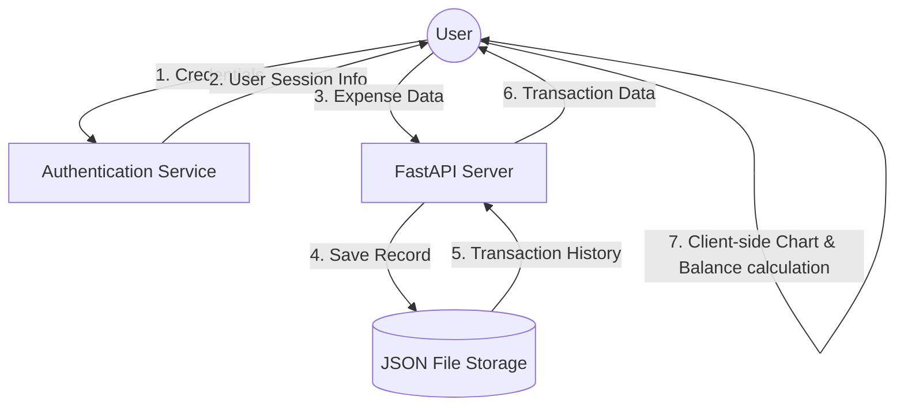

# 16 - Data Flow Diagram (DFD)

This diagram shows how data flows through the **Personal Expense Tracker** system.

### Flow Explanation:
1. **User Auth:** User provides login info; system verifies credentials and returns user details for local session persistence.
2. **Transaction Entry:** User sends expense details (Amount, Category).
3. **Data Storage:** Backend controller saves the data into the `data.json` database file.
4. **Data Retrieval:** Backend retrieves user transaction history from `data.json` records.
5. **UI Update & Calculation:** React Frontend calculates the current balance, aggregates category percentages, renders the Recharts Pie Chart, and updates the user's dashboard.
