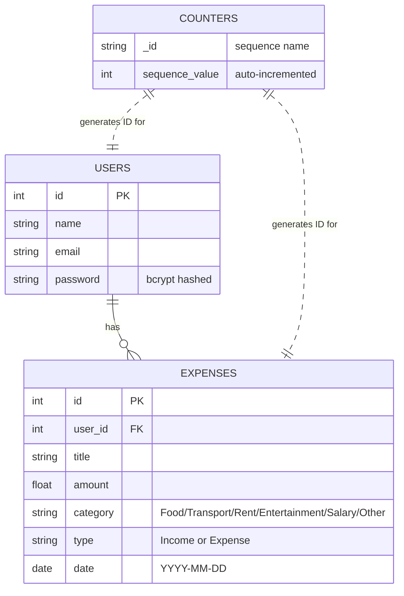

# 18 - Entity Relationship Diagram (ERD)

This diagram represents the data structure for the **Personal Expense Tracker** using MongoDB NoSQL collections.

> **Note:** MongoDB is a document-based NoSQL database. There are no traditional foreign key constraints. Relationships are maintained via integer reference fields (`user_id`) generated by an atomic counter collection.

### Collection Details:
1. **USERS:** Stores authentication data. One user can have many expense records.
2. **EXPENSES:** Stores individual income/expense transactions linked to a user via `user_id`.
3. **COUNTERS:** Internal atomic counter collection that generates sequential integer IDs for `users` and `expenses` collections (maintains frontend compatibility).
