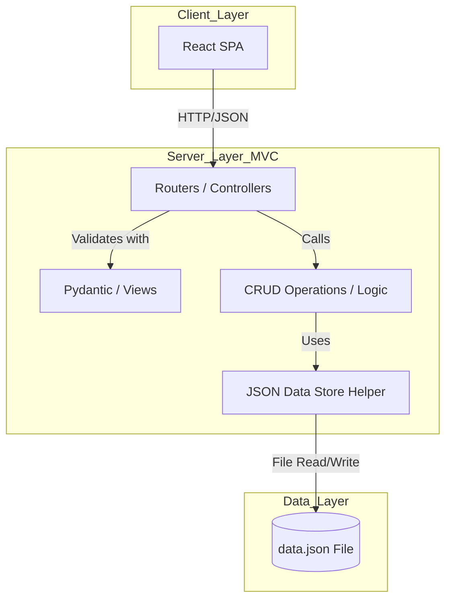

# 19 - System Design (Architecture)

The **Personal Expense Tracker** follows a classic 3-tier architecture with an MVC pattern in the backend.

### Components:
1. **Frontend (React):** Handles the user interface, routing, budget settings, local storage configurations, and data visualization (Recharts Pie Charts).
2. **Backend (FastAPI - MVC Pattern):** 
   - **Controllers (Routers):** Handles incoming HTTP requests and directs them to business logic controller methods.
   - **Views (Schemas):** Validates and serializes HTTP request and response structures using Pydantic schemas.
   - **CRUD / Store Logic:** Manages transaction registers and user data entries in memory and persists them using `store.py`.
3. **Database (data.json):** A local JSON file database that persists user and transaction records in standard structured arrays.
4. **Authentication:** Uses hashed passwords (via `bcrypt` hashing) on registration/login and persists authenticated user details in the client browser's `localStorage` session.
